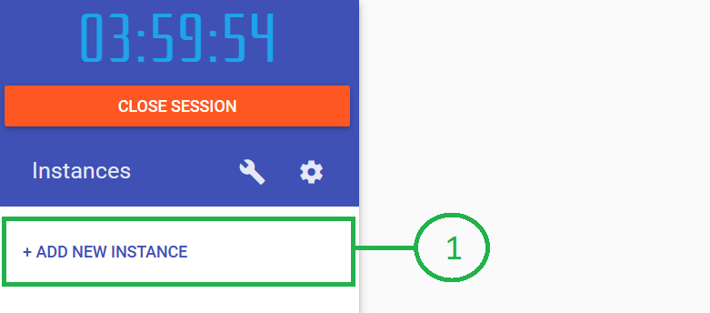
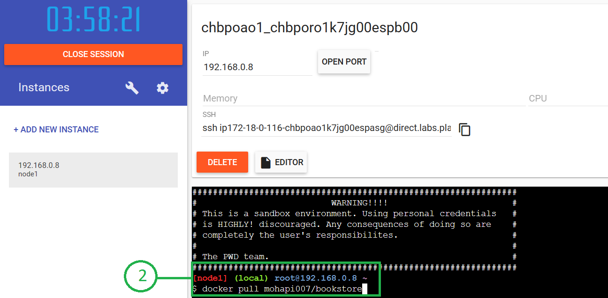
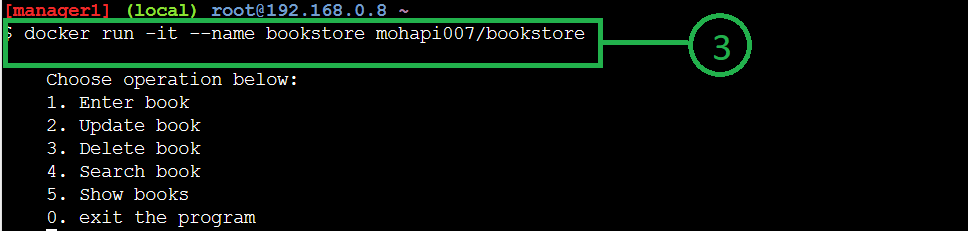

# eBookstore 
This is an eBookStore management app  

---  
## Tech Stack  
Python | SQLite | Docker  
[](https://skillicons.dev)  

## Setup  
If you do not have Docker account, please create one <a href="https://www.docker.com">HERE</a>  
  
Assuming Docker account exists, login to <a href="https://labs.play-with-docker.com/">DOCKER LABS</a>  

1. Add an instance inside docker labs  
  

1. Pull bookstore image from docker hub. 
    ```
    docker pull mohapi007/bookstore  
    ```  
      

1. Run the image. Name the container, 'bookstore'  
so as not to forget which container bookstore is in.  
    ```  
    docker run -it --name bookstore mohapi007/bookstore  
    ```  
       
  
1. The program is now ready to be used.  
  
1. Enjoy :smiley:
